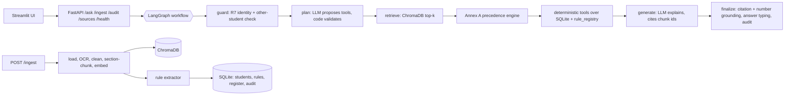

# University Student Services Assistant

HCLTech Future Ready AI Engineer Hackathon. An assistant that answers student questions from authorised
university documents and student records, with citations, Annex A conflict resolution, deterministic
eligibility tools, live document ingestion, audit trails and a measured evaluation.

## Architecture



One linear LangGraph workflow, not multi-agent. Every branch is decided by code; the only two LLM
calls (plan, answer) are validated afterwards. We deliberately did not add agents because no step
needs autonomous looping, and every authoritative result (eligibility, numbers, which rule applies)
must be deterministic (R5).

| Guarantee | Where it is enforced |
|---|---|
| Identity only from the login token, never from text (R7) | `api/auth.py` (password login, JWT); `graph/safety.py`; tools only ever receive the token's student ID |
| A student sees only their own records | `/ask` and `/audit/{trace_id}` require the token; another student's trace returns 404 |
| Only an admin adds official documents, students or rules | `/admin/*` need the admin role; on `/ingest` a student's upload is forced to authority level 5 (unofficial), gets its own `STU-<student_id>-` doc_id so it cannot replace another document, and sets no rules |
| A document cannot set its own authority | the admin picks the level; `ingestion/metadata_extractor.py` reads everything else and code checks it against the text |
| Eligibility and numbers come from code (R5) | `tools/`; verdict sentence built by `graph/templates.py`, not the LLM |
| Every threshold traces to a clause | `rule_registry.source_doc_id/section`, auto-extracted on ingest |
| Annex A precedence | `ingestion/precedence.py`, used for both chunks and rules |
| No fabrication (R3) | finalize rejects answers citing unknown chunks or numbers not in evidence |
| Document text cannot instruct the model (R8) | evidence labelled as data and instruction-like sentences stripped and logged |

## Tech stack

| Layer | Options in the guide | Our choice and why |
|---|---|---|
| UI | Streamlit or React | **Streamlit**: the UI is scored only for usability, so the least code wins |
| API | FastAPI + Uvicorn + Pydantic v2 (fixed) | Contract models in `shared/schemas.py` |
| Orchestration | LangGraph (fixed) | One conditional workflow, six nodes |
| Vector store | ChromaDB persisted to disk (fixed) | One collection per retrieval config; not re-ingested on restart |
| Structured data | SQLite (fixed) | Annex C schema plus source_register and audit_log tables |
| Embeddings | all-MiniLM-L6-v2 or bge-small-en-v1.5 | **Both**, switchable with `EMBEDDING_MODEL`; chosen by eval numbers |
| LLM | Ollama: llama3.1:8b or qwen2.5:7b-instruct | **qwen2.5:7b-instruct**, called with a JSON schema; cloud fallback off by default |
| Packaging | Docker + docker compose (fixed) | Ollama on the host |
| Extra libraries | open | PyMuPDF (text), pdfplumber (tables), pytesseract (OCR) |

## Run it

```bash
ollama pull qwen2.5:7b-instruct          # on the host, before the event
cp .env.example .env                      # set REGISTER_CSV once your real documents are added
docker compose up --build                 # API :8000, UI :8501
```

Without Docker:

```bash
pip install -r requirements.txt
python scripts/seed_all.py                # schema, synthetic students, documents, rules
uvicorn api.main:app --reload
streamlit run ui/streamlit_app.py
```

Without a model (`MOCK_LLM=true`), the full pipeline runs with deterministic stand-ins for the two LLM
tasks. Tests use this with an offline hash embedder: `pytest -q`.

## Login

The chat is behind a login. `POST /auth/login` checks the password and returns a
JWT (HS256, 2 hours); `/ask` and `/audit/{trace_id}` require it as `Authorization: Bearer <token>` and
take the student's identity from it. The `X-Student-Id` header is ignored.

- Every student's first password is `Pass@<student_id>`, for example `Pass@S1004`. This also applies to
  students loaded later with `scripts/load_students.py`. Change it with `POST /auth/change-password`.
- Passwords are stored as plain text in the `student_credentials` table and in
  `data/generated/credentials.csv`. Anyone who can read the database or that file can log in as any
  student, so this is only suitable for the synthetic demo data.
- One admin account is created on first start from `ADMIN_USERNAME` / `ADMIN_PASSWORD` (default
  `admin` / `Admin@123`) and logs in through the same form. Only an admin can choose a document's
  authority level, supply its metadata, or call `/admin/load-students` and `/admin/rules`. An admin
  has no student records, can ask about the documents, and can read any audit trace.
- A student can also add a document, but always at authority level 5 (unofficial): it is searchable by
  everyone as information only, never overrides an official source, and sets no rules.
- The UI always answers as of today. `as_of_date` is still accepted by `POST /ask` for tests and the
  evaluation.
- The signing key is `JWT_SECRET`; if unset, one is generated into `storage/jwt_secret`.
- `AUTH_REQUIRED=false` restores the original contract (identity from `X-Student-Id`, no login) for a
  test harness that cannot log in. Do not use it with real data.

## Sample requests

```bash
TOKEN=$(curl -s 127.0.0.1:8000/auth/login -H 'Content-Type: application/json' \
  -d '{"student_id":"S1004","password":"Pass@S1004"}' | python -c "import sys,json;print(json.load(sys.stdin)['access_token'])")

curl -s 127.0.0.1:8000/ask -H 'Content-Type: application/json' -H "Authorization: Bearer $TOKEN" \
  -d '{"question":"Am I eligible to appear in the end-semester exam for Data Structures?","as_of_date":"2026-10-06"}'

curl -s 127.0.0.1:8000/ask -H 'Content-Type: application/json' -H "Authorization: Bearer $TOKEN" \
  -d '{"question":"What is the minimum attendance required to appear for end-semester exams?"}'

ADMIN=$(curl -s 127.0.0.1:8000/auth/login -H 'Content-Type: application/json' \
  -d '{"student_id":"admin","password":"Admin@123"}' | python -c "import sys,json;print(json.load(sys.stdin)['access_token'])")

# admin only: choose the authority level, the rest of the metadata is extracted from the document
curl -s 127.0.0.1:8000/ingest -H "Authorization: Bearer $ADMIN" -F file=@circular.pdf -F authority_level=2

# or supply the full metadata yourself (original contract)
curl -s 127.0.0.1:8000/ingest -H "Authorization: Bearer $ADMIN" -F file=@circular.pdf -F 'metadata={"doc_id":"ACAD-2026-11","title":"Circular",
  "issuer":"Dean (Academics)","authority_level":2,"doc_type":"circular","effective_from":"2026-10-01",
  "supersedes":"ACAD-REG-2024#7.2","scope_programmes":"B.Tech","scope_batches":"ALL"}'

curl -s 127.0.0.1:8000/audit/<trace_id> -H "Authorization: Bearer $TOKEN"     # only your own traces
curl -s 127.0.0.1:8000/sources
curl -s 127.0.0.1:8000/health
python scripts/load_students.py --dir test_students/        # judge test-student loader
```

## Evaluation

```bash
python -m eval.run_eval --configs minilm:section:900:6 bge:section:900:6 minilm:fixed:900:6
```

Writes `eval/results/report.md` with all six Section 7 metrics per configuration. The 25 questions in
`eval/eval_set.jsonl` cover 3 unanswerable, 4 version/conflict, 7 personal tool-based, 2 multi-step
what-if, 3 refusals (2 other-student, 1 no identity), 4 policy/procedure, 1 prompt-injection and 1
clarification case.

On the offline test setup, section-aware chunking answers 25/25 correctly while fixed-window chunking
drops to 21/25: windows that span clauses lose the exact clause number, so clause-level supersession
("ACAD-REG-2024#7.2") cannot match and the superseded 75% leaks through. Re-run with Ollama and both
real embedders to fill in the final numbers.

## Repository layout

```
ingestion/  loader, OCR, cleaning, chunking, embeddings, Chroma,
            source register, Annex A precedence engine                (Member 1)
docs/       source register, documents, sample corpus                 (Member 1)
            audit_samples/: sample audit records                       (Member 4)
data/       Annex C schema, synthetic generator + prompts, validator,
            loader, edge-case spec                                     (Member 2)
tools/      student tools, eligibility/what-if tools, rule registry,
            rule extractor, tool catalogue                             (Member 2)
graph/      LangGraph workflow, safety, planner, templates, prompts    (Member 3)
api/        FastAPI contract, login (JWT), audit store                 (Member 3)
ui/         Streamlit                                                  (Member 4)
eval/       evaluation set + harness + report                          (Member 4)
shared/     config, Pydantic schemas, LLM client                       (Member 4; schemas agreed by all)
            security.py: password check and JWT                        (Member 3)
tests/      one test file per layer, owned by that layer's member; conftest.py (Member 4)
```

Each member's hand-over note is in the repository root: `ROLE_1_RAG_PIPELINE.md`,
`ROLE_2_DATA_AND_TOOLS.md`, `ROLE_3_LANGGRAPH_AND_FASTAPI.md`,
`ROLE_4_PLATFORM_UI_AND_EVALUATION.md`. Full ownership list: `CONTRIBUTIONS.md` and `.github/CODEOWNERS`.

## Assumptions

- The pass mark, attendance, placement and supplementary thresholds come from whichever documents are
  ingested. The sample corpus mirrors the Annex A worked example (75% regulation, 80% circular, 65% FAQ).
- A rule with batch scope applies only to those batches. For a general (not logged-in) question, a
  batch-specific document never overrides an all-batch one; the answer notes the narrower rule instead.
- Supplementary what-if assumes CGPA is unchanged after the supplementary result; this is stated in
  every such answer.

## Limitations and known edge cases

- Rule extraction is pattern-based for five parameters (attendance, pass mark, placement CGPA,
  placement backlogs, supplementary eligibility). Other thresholds must be added through
  `data/seed/rules_seed.csv`, the `rules` field of `/ingest`, or `POST /admin/rules`.
- Disagreement between two documents is detected by the LLM (semantic), but which one wins is
  always decided by code. A 7B model can miss a disagreement; the evaluation measures this.
- Clause numbers are detected from headings like `7.2 Title`. Documents numbered differently
  (for example `Rule (iv)`) get coarser sections; check citations after ingesting them.
- OCR quality depends on scan quality; scanned tables are the weakest case.
- Automatic metadata can only contain what the document states. If it gives no effective date, the
  upload date is used; if it names no programme or batch, the scope is ALL; a supersession is recorded
  only when the document says so explicitly and the superseded document is already in the register.
  The response lists every field with how it was obtained, so the admin can check it; to correct a
  field, re-upload with the full `metadata` JSON (the same `doc_id` replaces the document).
- The audit samples in `docs/audit_samples/` were generated in mock mode; regenerate them with
  `python scripts/export_audit_samples.py` against Ollama before submission.

## Cloud fallback disclosure

`CLOUD_FALLBACK=true` with an OpenAI-compatible `CLOUD_BASE_URL` is used only if Ollama fails after
retries. It is disabled by default and was not used for the reported results.
